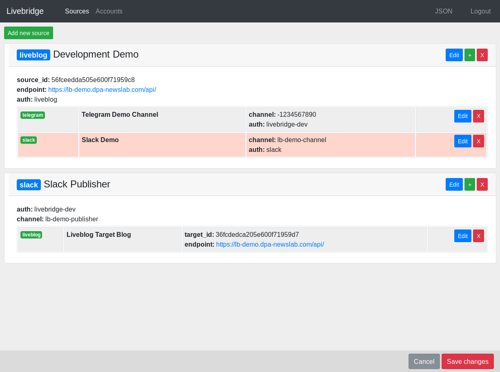

.. _control:

Control bridges
===============

The bridges will be specified by extra control-data, which can be stored in an extra .yaml control file \
or as JSON in a database table.

This control-data ca be edited directly or by a web-frontend.

Control bridges via web-UI
---------------------------

- Setup :ref:`Web-API <webapi>`
- Open the adress **http://[LB_WEB_HOST]:[LB_WEB_PORT]**
- You'll be asked for username and password, which have been declared via **LB_WEB_USER** and **LB_WEB_PWD**.
- Fill in the authorization credentials for your sources and targets under the **Accounts** tab.
- Specify the bridges and targets you want to connect under the **Sources** tab.
- Existing sources and targets can be edited too.
- Changes at existing data will be highlighted in red.
- To store the modifications made, click the **Save changes** button in the bottom bar.
- Alternatively convert your existing yaml-formatted controlfile to JSON and paste it under **JSON** in the textarea and save it.

.. note::
    Please use unsecured **http://** connections only while in development. Securing the connection to the web-UI
    via **https://** is highly recommended!

Control data in .yaml file
--------------------------

The **livebridge** command expects a **-control=** parameter or alternatively the **LB_CONTROLFILE** environment var. \
It specifies the path to a control file with the configuration for the content bridges.

**--control / LB_CONTROLFILE** can be either a **local control file** or a **remote control file** on **s3**:

* with local control file

.. code-block:: bash

    livebridge --control=/path/to/control.yaml

* with remote control file on S3

.. code-block:: bash

    livebridge --control=s3://bucketname/control.yaml

* with remote file on S3, specified via environment variable

.. code-block:: bash

    LB_CONTROLFILE=s3://bucketname/control.yaml livebridge

The bridges, over which the content is syndicated, are setup in this control file in *YAML* format. Use \
`control.yaml.example`_ as basis for your own control file.

.. code-block:: yaml

    auth:
        dev:
            user: "dev"
            password: "pwd"
            api_key: "F00Baz"
        live:
            user: "prod"
            password: "pwd2"
            api_key: "Foobar"
    bridges:
        - source_id: "abcdefg"
          endpoint:  "https://example.com/api/"
          label: "Example 1"
          targets:
            - type: "scribble"
              event_id: "123456"
              auth: "dev"
            - type: "another"
              event_id: "654321"
              auth: "live"
        - source_id: 54321
          endpoint:  "https://foo.org/api/"
          label: "Example 2"
          targets:
            - type: "scribble"
              event_id: "123456"
              auth: "dev"

Control data stored in database
-------------------------------

The configuration for bridges can also be saved in the database storage used. This can be either a SQL-based database supported by SQLALchemy_ or `AWS DynamoDB`_.

The name of the table has to be specified by an environment var, either by **LB_DB_CONTROL_TABLE** (SQL) or **LB_DYNAMO_CONTROL_TABLE** (DynamoDB). The table will be created, if it does not exist.

The data is stored as **JSON** and looks correspondent to the example above the following way:

.. _controljson:

.. code-block:: json

    {
        "auth": {
            "dev": {
                "user": "dev",
                "password": "pwd",
                "api_key": "F00Baz"
            },
            "live": {
                "user": "prod",
                "password": "pwd2",
                "api_key": "Foobar"
            }
        },
        "bridges": [
            {
                "source_id": "abcdefg",
                "endpoint":  "https://example.com/api/",
                "label": "Example 1",
                "targets": [
                    {
                        "type": "scribble",
                        "event_id": "123456",
                        "auth": "dev"
                    },{
                        "type": "another",
                        "event_id": "654321",
                        "auth": "live"
                   }
                ]
            },{
                "source_id": 54321,
                "endpoint": "https://foo.org/api/",
                "label": "Example 2",
                "targets": [
                    {
                        "type": "scribble",
                        "event_id": "123456",
                        "auth": "dev"
                    }
                ]
            }
        ]
    }

Authorization
-------------

Credentials for service authorization are defined under **auth:**, in which the keys \
like **dev** or **live** are later used for reference under **bridges:** and **targets:**. 

Handling of changed control-data
--------------------------------

When using a SQL-based storage-backend, a running Livebridge process is constantly checking in the background
for changed control-data.

If a change is detected (*means the control-data of a bridge was altered, removed or added*), the running process will start,
stop or restart the specific bridge(s).

.. note::
    You can define the interval (in seconds) for this check by setting **LB_POLL_CONTROL_INTERVAL**. Default is \
    60 seconds.

    Local control files aren't checked for changes automatically. By setting **LB_CONTROLFILE_WATCH** to **true**, this check \
    can be forced.

    When using DynamoDB as storage-backend, an *AWS SQS* queue has to be used for signalling changed control-data. This
    queue can be configured via **LB_SQS_S3_QUEUE**.

Bridges
-------

One or more bridges can be controlled under **bridges:**.

Mandatory for every source or target is **type:**, which is a string and has to match the values \
of :py:attr:`livebridge.base.BaseSource.type` or :py:attr:`livebridge.base.BaseTarget.type` of the \
described concrete source or target plugin.

All configuration values besides **type:** will be turned over to the concrete target and source classes as \
**__init__** parameter **config**.

If there's an **auth:** value for the source or target, the value will be matched to a block under **auth:** \
and these values will be merged under **auth:** of the source/target. For example the last target from the example above will be \
resolved from **Livebridge** to following Python dict structure:

.. code-block:: python

    { 
        'type': 'scribble',
        'event_id': '123456',
        'auth': {
            'user': 'dev',
            'password': 'pwd',
            'api_key': 'F00Baz'
        }
    }

Sources
-------

A block for a source consists of parameter for the source and one or multiple **targets:** blocks.

Targets
-------

A block for a target consists of parameter for the target.

.. include:: links.rst
